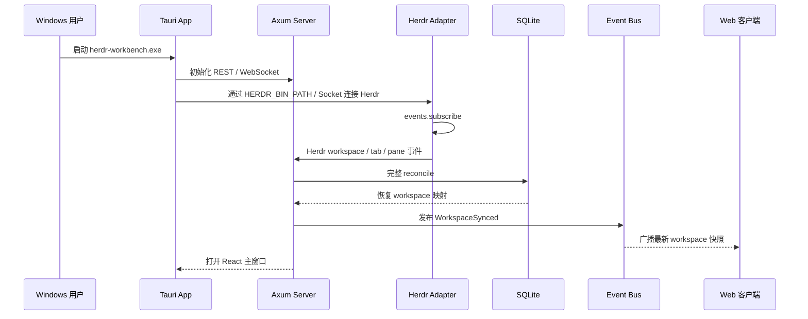
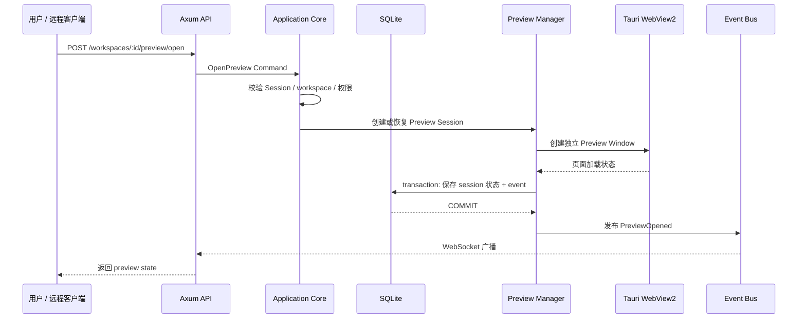
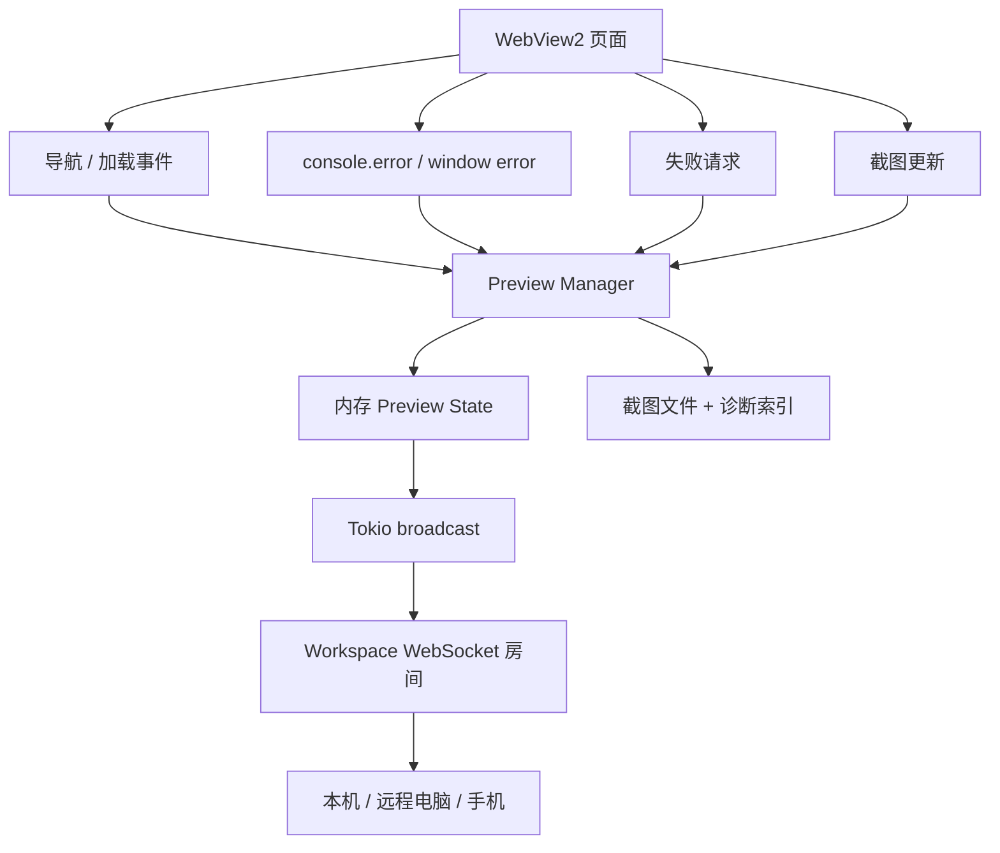
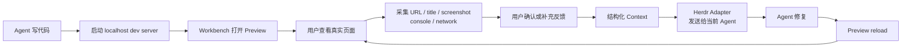
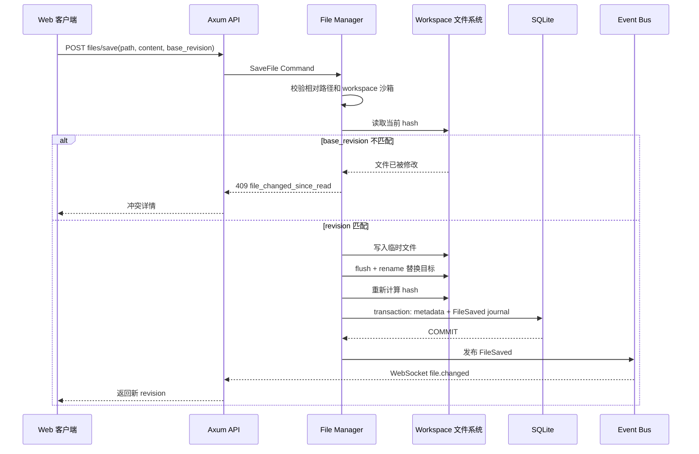
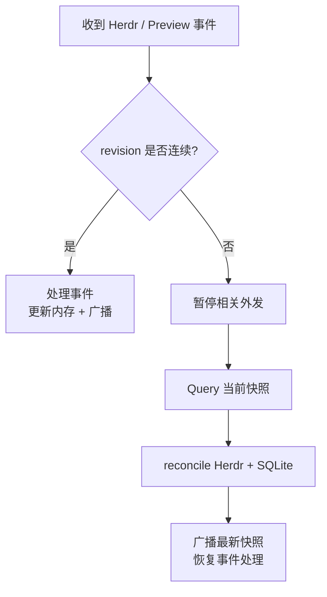

# Herdr Workbench 核心流程

## 1. 应用启动与 workspace 同步

兜底规则：启动和 Herdr 重连执行完整 reconcile；正常运行依赖事件；默认每 30 秒轻量协调一次；Herdr 不可用时退避到 2 分钟。

## 2. 打开 Preview Session

## 3. 浏览器诊断与远程同步

高频事件优先进入内存和 WebSocket；截图文件保存到 `%LOCALAPPDATA%\\HerdrWorkbench\\screenshots`，SQLite 只保存路径、hash、大小和 revision。重要诊断可按策略进入 journal，不能无限写入数据库。

## 4. Browser-to-Agent Feedback

Context 发送不允许直接拼接任意终端输入。Application Core 生成结构化反馈，Herdr Adapter 使用已确认的 Agent / pane 身份发送。

## 5. 文件保存流程

文件系统是源码事实来源。若文件替换成功但 SQLite 提交失败，保留新文件并标记 `pending_reconcile`，由协调器重新扫描 metadata；不引入跨文件系统和数据库的伪事务。

## 6. 事件丢失恢复

Tokio `broadcast` 出现 `Lagged` 时，订阅者不能尝试补造事件；重新 Query 当前状态即可。
