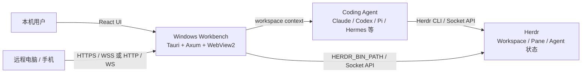
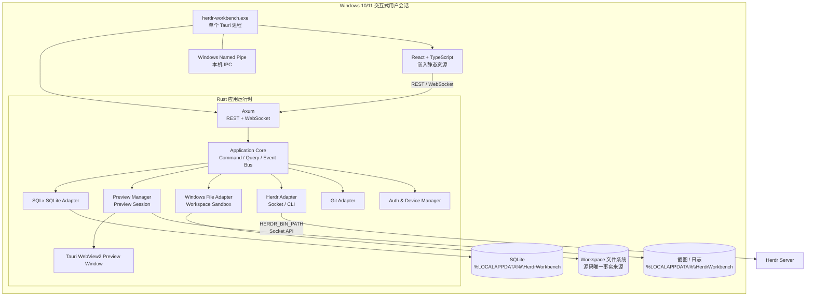
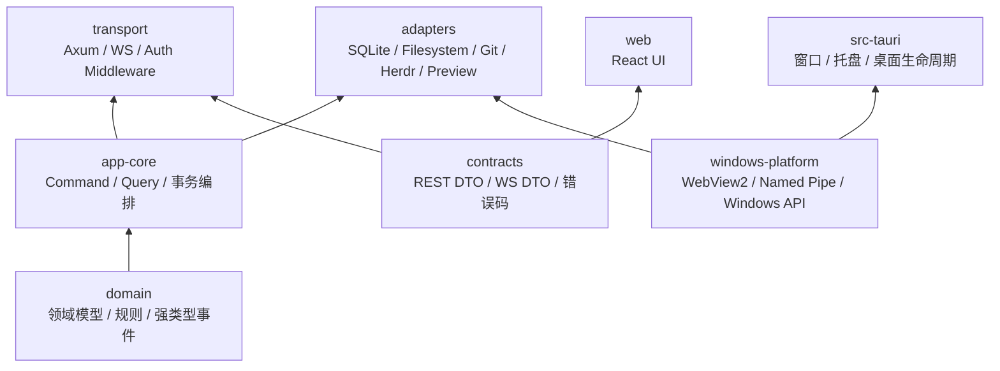
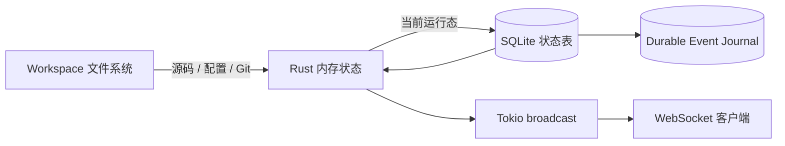
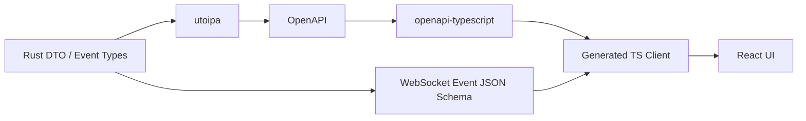

# Herdr Workbench 架构总览

> 当前架构基线：Windows-first、模块化单体、单个 Tauri 进程内嵌 Axum 服务，远程客户端统一使用 HTTP/WebSocket。

## 1. 系统上下文



## 2. 部署架构



## 3. 代码依赖方向



约束：

- `domain` 不依赖 Axum、SQLite、Tauri 或 Windows API。
- `app-core` 只依赖 Adapter Interface，不依赖具体基础设施实现。
- `transport` 不直接读写 SQLite。
- `web` 只依赖生成的 contracts，不知道 Rust 内部模块。
- Windows API 只存在于 `windows-platform` 和对应 Adapter。

## 4. 核心模块

| 模块 | 职责 | 主要接口 |
| --- | --- | --- |
| `domain` | 领域模型、Command、Query、Event、业务规则 | 强类型值对象和事件 |
| `app-core` | 权限校验、事务编排、revision、事件发布 | Application Service |
| `contracts` | REST / WebSocket 对外 DTO、错误结构 | OpenAPI / JSON Schema |
| `transport` | HTTP 路由、WebSocket 会话、认证中间件 | Axum Handler |
| `preview` | Preview Session 生命周期、导航、诊断、截图 | `PreviewManager` |
| `workspace` | Herdr workspace 映射和 reconcile | `WorkspaceManager` |
| `files` | workspace 沙箱、读取、保存、版本冲突 | `FileManager` |
| `git` | diff、分支、状态查询 | `GitAdapter` |
| `agent` | Herdr Agent 状态和上下文发送 | `HerdrAdapter` |
| `auth` | 用户、Session Cookie、设备和权限 | `AuthManager` |
| `adapters` | 外部系统具体实现 | Adapter implementations |
| `windows-platform` | WebView2、Named Pipe、防火墙、启动 | Windows Adapter |

## 5. 事实来源和状态



- Workspace 文件系统：源码、配置和资源的唯一事实来源。
- SQLite 状态表：Workbench 当前可查询状态。
- Durable Event Journal：重要状态变化、审计和 revision 同步记录。
- Rust 内存：WebView2、连接和临时运行态。
- Tokio `broadcast`：进程内实时传播，不负责补发历史。
- WebSocket：对外实时通知，断线后通过 Query 恢复。

重要 Command 的顺序：

```text
权限校验
→ workspace / revision 校验
→ 执行外部副作用
→ SQLite transaction
   ├── 更新状态表
   └── 写入 durable event
→ COMMIT
→ 发布 AppEvent
→ WebSocket 广播
→ 返回响应
```

## 6. API 契约链



Rust 类型是唯一契约源。REST 使用 `utoipa` 生成 OpenAPI；WebSocket 事件使用相同的强类型事件定义并生成 JSON Schema / OpenAPI 扩展。
