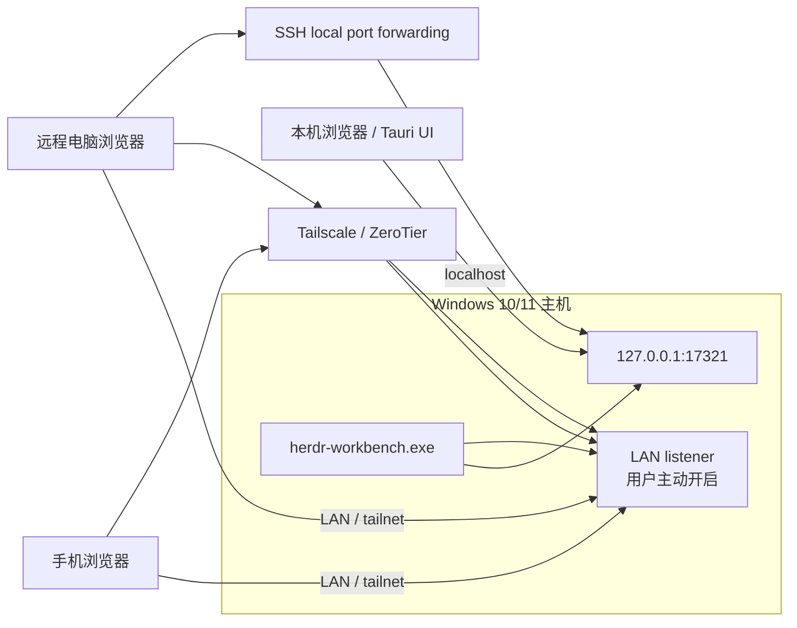
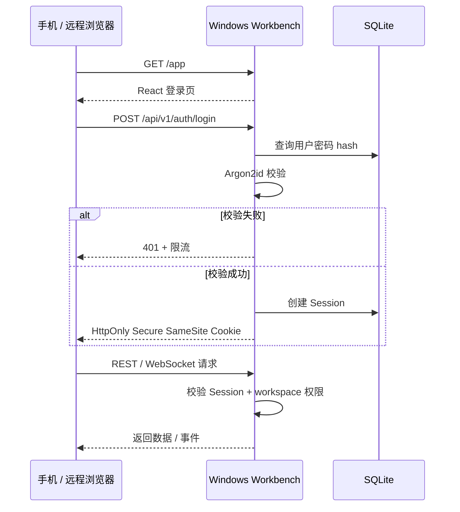
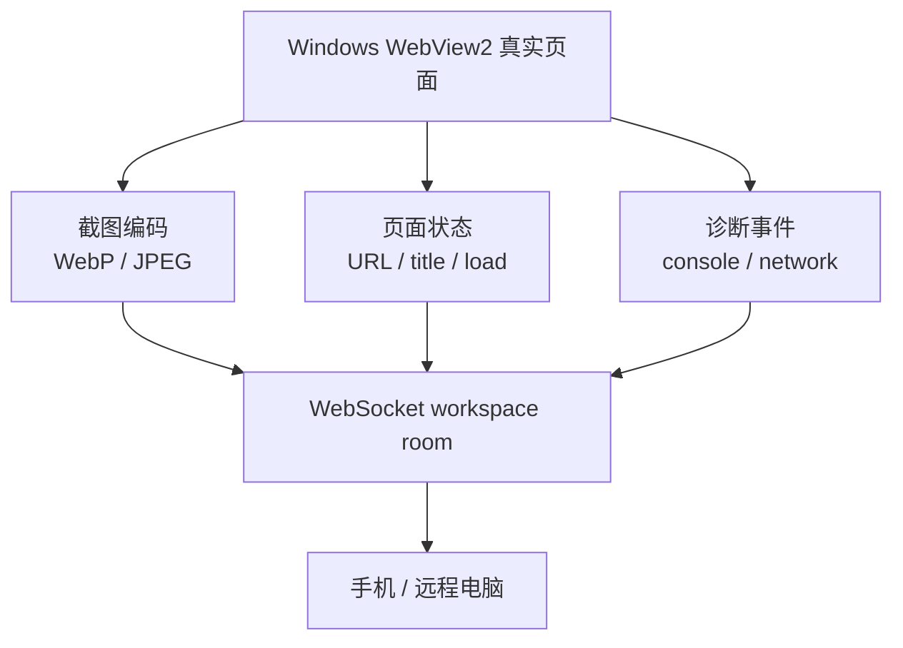

# Herdr Workbench 远程访问架构

## 1. 访问拓扑



## 2. 访问策略

| 模式 | 默认状态 | 访问方式 | 认证 |
| --- | --- | --- | --- |
| 本机 | 开启 | `127.0.0.1:17321` | 本机会话 / 账号密码 |
| 局域网 | 关闭 | Windows Private network IP | 账号密码 |
| Tailscale / ZeroTier | 关闭 | tailnet 地址 | 账号密码 + HTTPS/WSS |
| SSH 隧道 | 用户配置 | `127.0.0.1` 转发 | SSH + 账号密码 |
| 公网直连 | 不支持 | 无 | 无 |

网络层不替代应用层认证。Tailscale、ZeroTier 或 SSH 只负责传输路径，Workbench 仍负责用户、Session 和权限。

## 3. 登录流程



第一版可只有一个本地用户，但数据模型保留 users、sessions、roles 和 audit log，避免以后推翻认证接口。

## 4. 远程客户端能力

```text
viewer
├── workspace 状态
├── Preview 截图
├── 页面 URL / title
├── console / network 诊断
├── 文件只读查看
└── 事件订阅

reviewer
├── viewer 全部能力
├── 查看 Git diff
├── 添加反馈
└── 发送结构化 context

editor
├── reviewer 全部能力
├── 保存 workspace 内文本文件
└── 撤销自己的保存

operator
├── editor 全部能力
├── navigate / reload / back / forward
└── 有限 click / type / key / scroll

admin
└── 设备、用户、Session、端口和 workspace 管理
```

手机默认使用 `viewer + reviewer`，不默认开放写文件和 Agent 控制。

## 5. 端口和防火墙

- 默认只绑定 `127.0.0.1`。
- 开启 LAN 前明确显示风险和当前 Private network 地址。
- 只为 Private network 创建 Windows Firewall 入站规则。
- 规则限定 TCP 端口和用户配置的网络范围。
- 停用 LAN 时删除 Workbench 自己创建的规则，不碰用户已有规则。
- 端口冲突时返回明确错误，并建议选择其他端口。
- 不自动在路由器上做 UPnP、端口映射或公网暴露。

## 6. 远程画面传输



P0 使用截图 API；P1 使用 WebSocket 推送 revision 和事件；只有在确认截图不能满足需求时才评估 WebRTC 或实时视频流。
